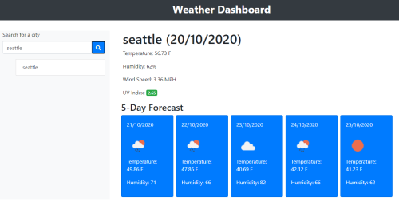
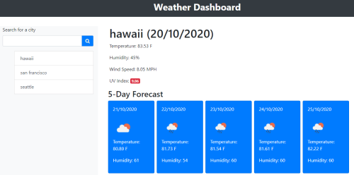

# 05: Server-Side API: Weather Dashboard

## Description 

This application let user to retrieve weather data from another application's API.  Using request with specific parameter and URL, this third party API allow access to their data and functionality.

## Usage 

1. User enters the city of their choice in the input area and current and 5-day forecast weather information will be displayed.

2. Upon reloading the page, historical searched will be displayed.

## Credits

Third party access: [OpenWEather API](https://openweathermap.org/) 

## Maintainer 
This is an individual assignment created by Carolina Yoedhana.
* GitHub Link: https://github.com/CarolinaYo/weather-dashboard-cy.git
* GitHub Page Link: https://carolinayo.github.io/weather-dashboard-cy/

